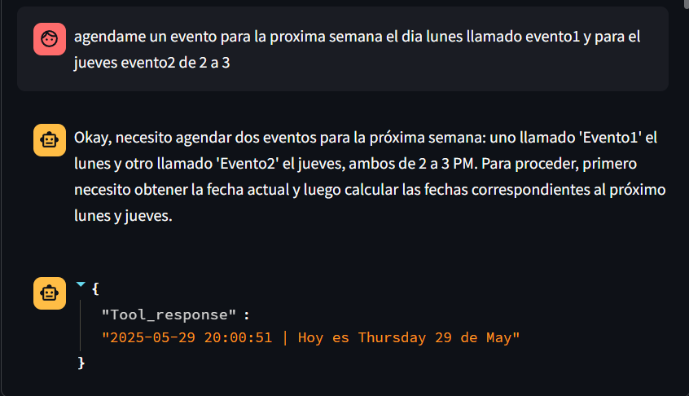
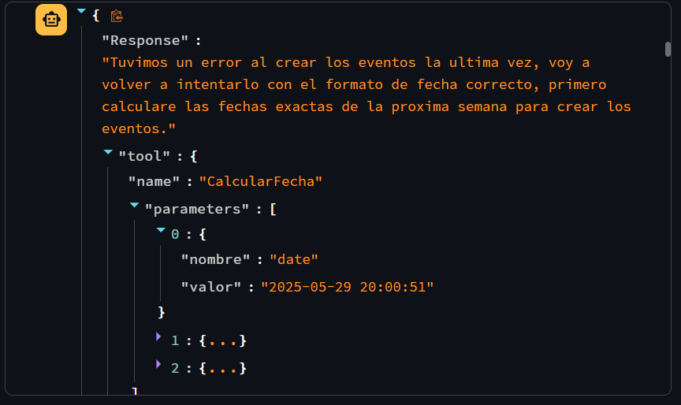

# Asistente ANGY

Este repositorio contiene una prueba de ejecución de un agente IA para leer, escribir y editar sobre una base de datos que contiene datos de una agenda.

El proposito es permitirle a una IA ejecutar acciones de un backend e intentar mediante herramientas o tools, ejecutar codigo y recibir retroalimentación de la misma, ademas de actuar por cuenta propia y decidir que pasos seguir para cumplir la tarea.

# Resultados

## Chat con el usuario

## Generación de la IA

## Calendario
