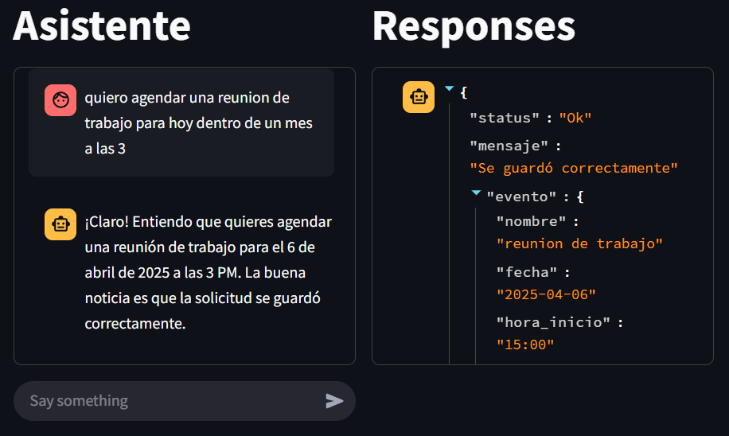
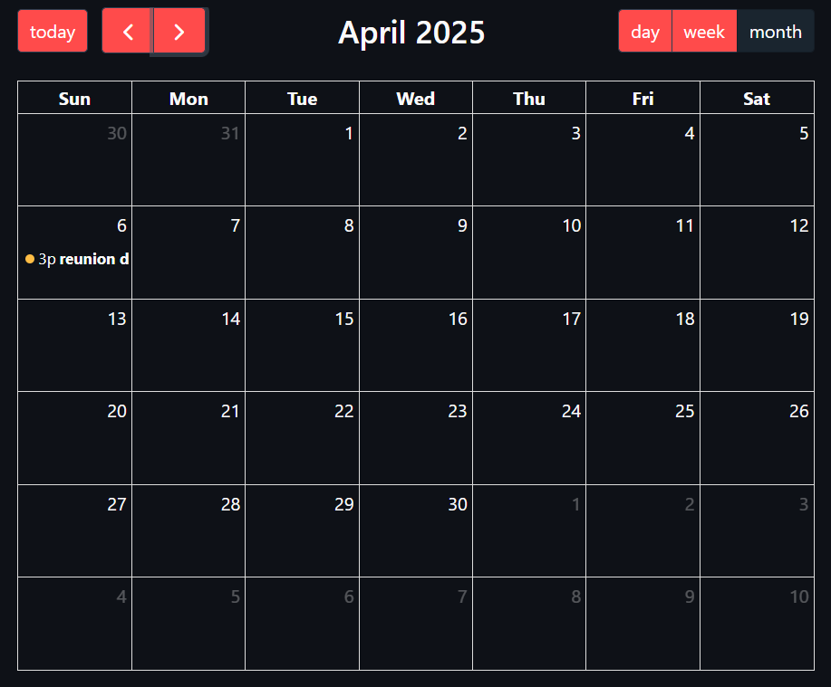
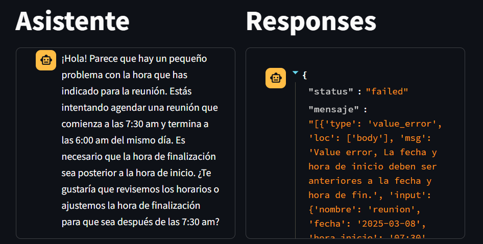
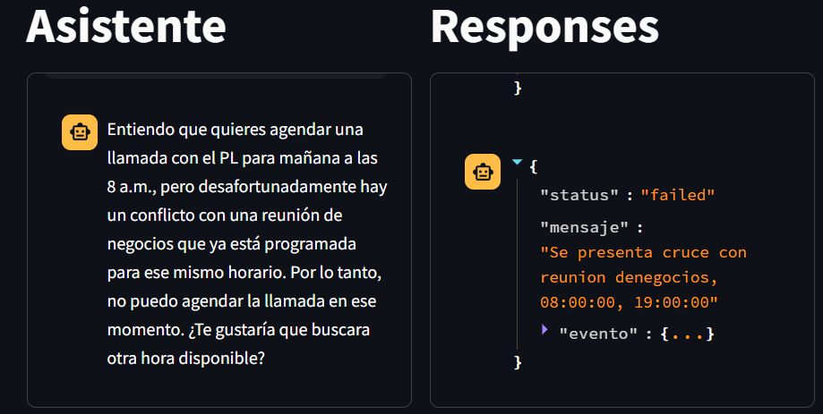
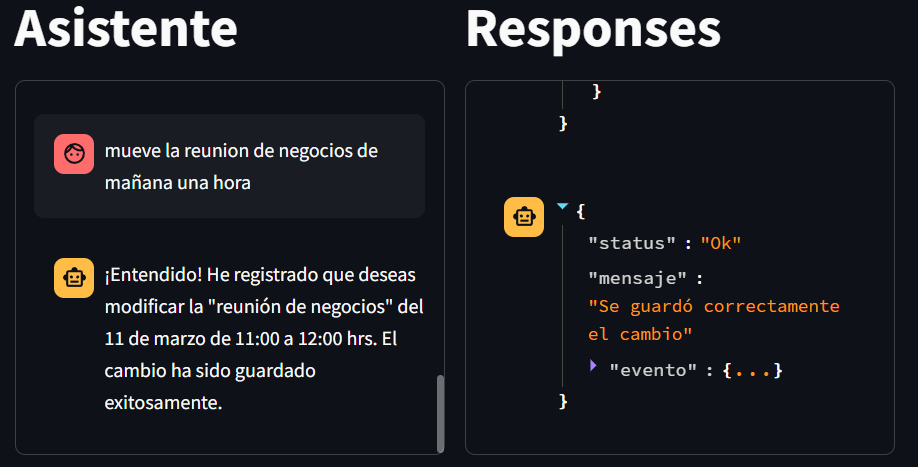

# Asistente inteligente de agenda

Este repositorio es una prueba sobre el uso de IA para hacer una interaccion humana con un sistema de agenda.








# Estructura

En este flujo el usuario hace una petición que es interpretada por el LLM, extrae los datos de la solicitud y los estructura en un formato json, y se escoge el tipo de solicitud adecuado para cumplir la petición del usuario. La entrada del usuario puede ser multimodal audio o texto.

Luego de ser procesada la solicitud, se retorna una respuesta y el LLM se encarga de procesarla junto con la respuesta de la API para entregar al usuario una respuesta en lenguaje natural.
</img>

# Ejecutar el proyecto
Para ejecutar es necesario un servidor de mongo, se recomienda con docker o podman para pruebas.

```sh
docker run --name agente-db -p 27017:27017 mongo
```

```sh
python3 -m venv .venv
source .venv/bin/activate
pip install -r requirements
```

copiar el ``.env.example`` como ``.env`` y colocar el token de gemini.
```sh
cp .env.example .env
```

```sh
fastapi run back/app.py
streamlit run agente/main.py
```